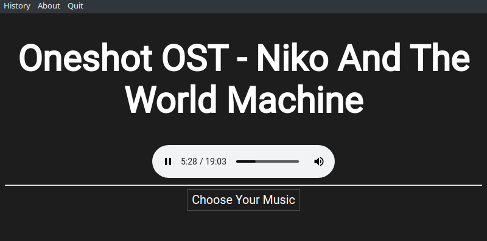

# Music Player
My own music player made for learning Electron. 

## Features 
- Play songs and keep track of playback history.
- Control everything from the tray (with a cute Godot icon).

## Installation
### Windows
- Download the latest executable file [here](https://github.com/tghgg/music-player/releases) and run it.
### Linux
- Download the latest AppImage file [here](https://github.com/tghgg/music-player/releases) and run it.
### MacOS
- TODO: Test the Mac binary myself.
- Download the latest zip file for Mac here [here](https://github.com/tghgg/music-player/releases) and extract it.
## License
Licensed under the MIT license.
